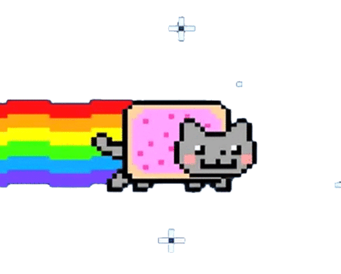

    
    
    
    
    
    
    

### I'm a FrontEnd Developer

### Languages and Tools

Follow Me

- 🔭 I’m currently working on ...
- 🌱 I’m currently learning ...
- 👯 I’m looking to collaborate on ...
- 🤔 I’m looking for help with ...
- 💬 Ask me about ...
- 📫 How to reach me: ...

### Connect with me:
